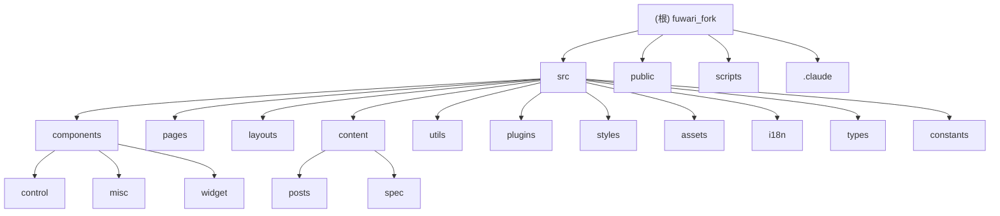

# Fuwari Fork - AI 上下文文档

## 变更记录 (Changelog)

### 2025-11-26
- 初始化AI上下文文档
- 完成项目架构扫描和分析
- 生成Mermaid结构图和模块索引

## 项目愿景

**Fuwarı Fork** 是一个基于 [fuwari](https://github.com/saicaca/fuwari) 的个人博客项目，使用现代化的 Astro 框架构建。该项目旨在提供一个快速、美观、功能丰富的博客平台，支持 Markdown 内容编写、多语言国际化、深色/浅色主题切换、评论系统等现代博客功能。

## 架构总览

### 技术栈
- **前端框架**: Astro 5.10.2
- **UI组件**: Svelte 5.34.8 + TailwindCSS 3.4.17
- **内容管理**: Astro Content Collections
- **代码高亮**: Expressive Code
- **页面过渡**: Swup
- **数学渲染**: KaTeX
- **搜索功能**: Pagefind
- **图片预览**: PhotoSwipe
- **开发工具**: TypeScript 5.8.3 + Biome 2.0.6

### 核心特性
- 📝 支持Markdown和MDX格式内容编写
- 🎨 响应式设计，支持移动端和桌面端
- 🌙 深色/浅色主题切换，支持主题色自定义
- 🌍 多语言国际化支持（中文、英文、日文、西班牙文等）
- 📱 移动端友好的导航和交互设计
- 🔄 平滑的页面过渡动画
- 🔍 全文搜索功能
- 📊 文章分类和标签管理
- 💬 集成Giscus评论系统
- 📜 文章归档和分页功能

## 模块结构图



## 模块索引

| 模块路径 | 类型 | 职责描述 | 关键文件 |
|---------|------|----------|----------|
| `/` | 项目根 | Astro项目配置和元数据 | `package.json`, `astro.config.mjs`, `tsconfig.json` |
| `src/components` | 组件库 | Astro和Svelte组件 | `Layout.astro`, `PostPage.astro`, `Navbar.astro` |
| `src/pages` | 路由页面 | Astro页面路由定义 | `[...page].astro`, `about.astro`, `archive.astro` |
| `src/layouts` | 布局模板 | 页面布局和结构 | `Layout.astro`, `MainGridLayout.astro` |
| `src/content` | 内容管理 | 博客内容和静态页面 | `config.ts`, `posts/`, `spec/` |
| `src/utils` | 工具函数 | 内容处理、URL处理、设置管理 | `content-utils.ts`, `url-utils.ts`, `setting-utils.ts` |
| `src/plugins` | 自定义插件 | Markdown和Rehype扩展插件 | `remark-excerpt.js`, `rehype-component-admonition.mjs` |
| `src/styles` | 样式文件 | CSS和Tailwind配置 | `photoswipe.css`, `transition.css` |
| `src/assets` | 静态资源 | 图片、字体等静态资源 | `images/` |
| `src/i18n` | 国际化 | 多语言支持配置 | `languages/`, `i18nKey.ts` |
| `src/types` | 类型定义 | TypeScript类型定义 | `config.ts` |
| `src/constants` | 常量定义 | 项目常量和配置 | `constants.ts`, `icon.ts` |
| `scripts` | 构建脚本 | 项目构建和维护脚本 | `new-post.js` |
| `public` | 公共资源 | 静态文件和资源 | `favicon/` |

## 运行与开发

### 开发环境启动
```bash
# 安装依赖
pnpm install

# 启动开发服务器
pnpm dev

# 类型检查
pnpm type-check

# 代码格式化
pnpm format

# 代码检查
pnpm lint
```

### 构建与部署
```bash
# 构建生产版本
pnpm build

# 预览构建结果
pnpm preview

# 创建新文章
pnpm new-post -- 文章名称
```

### 环境变量
项目支持以下环境变量（通过`.env`文件配置）：
- 无特定环境变量要求

## 测试策略

目前项目未配置自动化测试。建议添加以下测试类型：
- **单元测试**: 使用 Vitest 测试工具函数
- **组件测试**: 使用 Testing Library 测试 Astro/Svelte 组件
- **E2E测试**: 使用 Playwright 测试完整用户流程
- **构建测试**: 确保构建流程无错误

## 编码规范

项目使用 **Biome** 进行代码格式化和检查：
- **缩进**: 使用Tab缩进
- **引号**: JavaScript中使用双引号
- **代码风格**: 遵循Biome推荐规则
- **TypeScript**: 启用严格模式，包含类型检查
- **导入**: 自动排序和组织导入语句

### 关键配置
- **biome.json**: 代码风格和检查规则
- **tsconfig.json**: TypeScript配置，包含路径映射
- **tailwind.config.cjs**: TailwindCSS配置
- **astro.config.mjs**: Astro框架配置

## AI 使用指引

### 项目结构理解
- 这是一个单页应用(SPA)博客项目，主要逻辑在前端
- 内容存储在Markdown文件中，通过Astro Content Collections管理
- 组件分为Astro组件（服务端渲染）和Svelte组件（客户端交互）

### 开发建议
1. **内容创作**: 使用 `pnpm new-post` 命令创建新文章
2. **样式调整**: 主要通过修改Tailwind类和CSS变量
3. **功能扩展**: 优先考虑添加Svelte组件实现客户端交互
4. **国际化**: 通过 `src/i18n` 目录添加新语言支持
5. **SEO优化**: 关注 `src/layouts/Layout.astro` 中的meta标签配置

### 重要配置文件
- `src/config.ts`: 网站基本信息配置（标题、主题、导航等）
- `src/content/config.ts`: 内容集合Schema定义
- `astro.config.mjs`: Astro框架和插件配置
- `src/constants/constants.ts`: 全局常量定义

### 常见开发任务
- **添加新页面**: 在 `src/pages` 目录创建新的.astro文件
- **修改布局**: 编辑 `src/layouts` 中的模板文件
- **添加组件**: 在 `src/components` 中创建新组件
- **修改样式**: 编辑Tailwind类或CSS文件
- **配置主题**: 修改 `src/config.ts` 中的主题配置

## 相关文件清单

### 配置文件
- `package.json` - 项目依赖和脚本
- `astro.config.mjs` - Astro框架配置
- `tsconfig.json` - TypeScript配置
- `biome.json` - 代码风格配置
- `tailwind.config.cjs` - TailwindCSS配置
- `svelte.config.js` - Svelte配置
- `postcss.config.mjs` - PostCSS配置
- `.npmrc` - NPM配置
- `vercel.json` - Vercel部署配置
- `frontmatter.json` - FrontMatter配置

### 核心源文件
- `src/config.ts` - 网站配置
- `src/content/config.ts` - 内容配置
- `src/layouts/Layout.astro` - 主布局
- `src/layouts/MainGridLayout.astro` - 网格布局
- `src/pages/[...page].astro` - 分页页面
- `src/components/PostPage.astro` - 文章列表页面
- `src/utils/content-utils.ts` - 内容工具函数

### 忽略文件
- `.gitignore` - Git忽略规则
- `.vscode/` - VSCode配置
- `.idea/` - IntelliJ IDEA配置