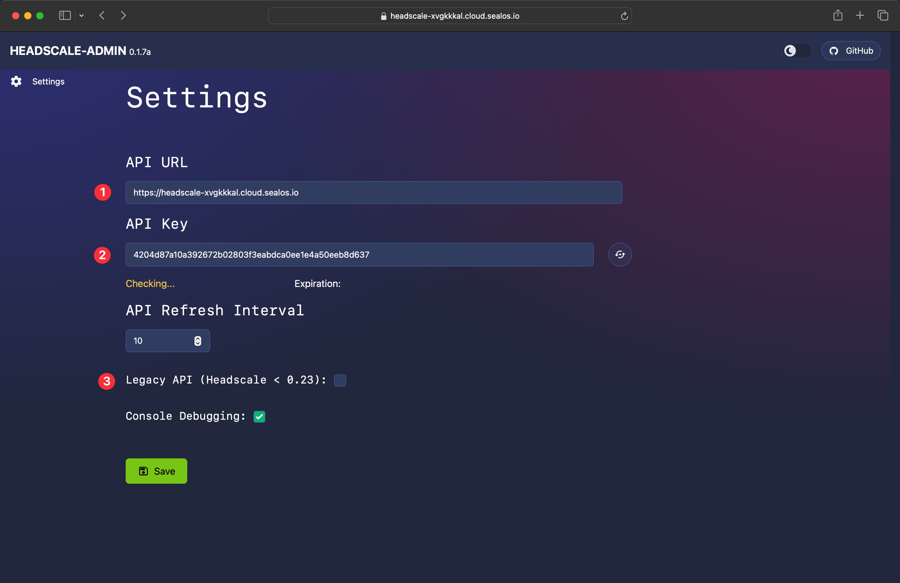

# 部署 Headscale

## 配置

1. 创建存放配置的文件夹
    ```bash
    mkdir -p /etc/headscale && mkdir -p /var/lib/headscale
    ```
2. 下载配置模板
    ```bash
    wget https://github.com/juanfont/headscale/raw/main/config-example.yaml -O /etc/headscale/config.yaml 
    ```
3. 修改配置
    ```bash
    vim /etc/headscale/config.yaml
    ```
   1. 将 127.0.0.1替换为 0.0.0.0（用于端口转发访问 headscale docker 服务）
   2. 关闭 DNS
      ```yaml
      dns:
        magic_dns: false
      ```
   3. 开启随机端口
      ```yaml
      randomize_client_port: true
      ```
   4. 填写 server_url
      ```yaml
      server_url: https://<domain>:<port>
      ```
## 部署
1. 创建 docker-compose.yaml
    ```bash
    vim docker-compose.yaml
    ```
    ```yaml
    version: "3"
    services:
      headscale:
        image: headscale/headscale:stable
        restart: always
        volumes:
          # 配置文件目录
          - /etc/headscale:/etc/headscale
          # 数据库目录
          - /var/lib/headscale:/var/lib/headscale
        command: serve
        ports:
          - 8080:8080
          - 9090:9090
    ```
2. 运行
    ```bash
    docker-compose up -d
    ```
3. 创建用户
    ```bash
    headscale user create <user>
    ```
    ```bash
    headscale user list
    ```
   
## 反向代理
- nginx 配置
   ```conf
   map $http_upgrade $connection_upgrade {
       default      upgrade;
       ''           close;
   }
   
   server {
       listen 443 ssl;
       ssl_certificate /etc/ssl/<domain>/cert.pem;
       ssl_certificate_key /etc/ssl/<domain>/key.pem;
   
       server_name <server_name>;
       charset utf-8;
   
       location / {
           proxy_http_version 1.1;
           proxy_set_header Upgrade $http_upgrade;
           proxy_set_header Connection $connection_upgrade;
           proxy_set_header Host $server_name;
           proxy_redirect http:// https://;
           proxy_buffering off;
           proxy_set_header X-Real-IP $remote_addr;
           proxy_set_header X-Forwarded-For $proxy_add_x_forwarded_for;
           proxy_set_header X-Forwarded-Proto $scheme;
           add_header Strict-Transport-Security "max-age=15552000; includeSubDomains" always;
           proxy_pass http://localhost:8080;
       }
       // 若不部署下面的 Web UI 管理面板可忽略以下配置
       location /admin {
           proxy_set_header Host $host;
           proxy_set_header X-Real-IP $remote_addr;
           proxy_set_header X-Forwarded-For $proxy_add_x_forwarded_for;
           proxy_set_header X-Forwarded-Proto $scheme;
           proxy_pass http://localhost:8000/admin;
           proxy_read_timeout 90s;
       }
   }
   ```
   
# Headscale Web UI控制面板（可选）
1. 部署面板
    ```bash
    docker run -itd -p 8000:80 goodieshq/headscale-admin:latest
    ```
2. 在 headscale 机器中生成 apikey
    ```bash
    headscale apikey create
    ```
3. 配置面板
    

# 节点安装 Tailscale

1. 添加 TailScale 的 package signing key 和 repository
    ```bash
    curl -fsSL https://pkgs.tailscale.com/stable/ubuntu/focal.noarmor.gpg | sudo tee /usr/share/keyrings/tailscale-archive-keyring.gpg >/dev/null
    ```
    ```bash
    curl -fsSL https://pkgs.tailscale.com/stable/ubuntu/focal.tailscale-keyring.list | sudo tee /etc/apt/sources.list.d/tailscale.list
    ```
2. 安装 Tailscale
    ```bash
    sudo apt-get update && sudo apt-get install tailscale
    ```

3. 注册
    1. 节点申请注册
        ```bash
        tailscale up --login-server=<server_url> --accept-routes=true --accept-dns=false 
        ```
        >To authenticate, visit:
        >
        >    https://qgemohpy.cloud.sealos.io/register/mkey:e13651ddbfc269513723f1afd6f42465e56922b67ecea8f37d61a35b1b357e0c

    2. 在浏览器中打开上述链接，会出现以下页面：
        
    3. 复制页面中的链接并将 USERNAME 改为上述创建用户时的用户名 ```<user>```，接着在 headscale 机器中运行
    4. 查看注册节点
        ```bash
        headscale nodes list
        ```

# 部署 DERP（中继服务器）
## 部署
1. 创建 docker-compose 文件
    ```bash
    vim docker-compose.yaml
    ```
    ```yaml
    version: '3'
    services:
      derper:
        image: ghcr.io/yangchuansheng/derper:latest
        container_name: derper
        restart: always
        ports:
          - "12345:12345"
          - "3478:3478/udp"
        volumes:
          # 关于证书部分需要重点说明：假设你的域名是 xxx.com，那么证书的名称必须是 xxx.com.crt，一个字符都不能错！同理，私钥名称必须是 xxx.com.key，一个字符都不能错！
          - /etc/ssl/<domain>/cert.pem:/app/certs/<domain>.crt
          - /etc/ssl/<domain>/key.pem:/app/certs/<domain>.key
          # 不做客户端校验可注释此行，建议开启客户端校验，否则别人拿到你的中继服务器可直接使用
          - /var/run/tailscale/tailscaled.sock:/var/run/tailscale/tailscaled.sock
        environment:
          - DERP_CERT_MODE=manual
          - DERP_ADDR=:12345
          - DERP_DOMAIN=<domain>
          # 不做客户端校验可注释此行，建议开启客户端校验，否则别人拿到你的中继服务器可直接使用
          - DERP_VERIFY_CLIENTS=true
    ```
2. 运行
    ```bash
    docker-compose up -d
    ```

    > 目前 derper 运行一段时间就会崩溃，暂时还没有更好的解决方案，只能通过定时重启来解决，比如通过 crontab 来设置每两小时重启一次容器:
    > ```0 */2 * * * docker restart derper &> /dev/null```
3. 修改 Headscale 配置
   1. 创建 Derp 服务器相关的配置
      ```bash
      vim /etc/headscale/derp.yaml
      ```
      ```yaml
      regions:
        900:
          regionid: 900
          regioncode: hk 
          regionname: Hongkong 
          nodes:
            - name: claw
              regionid: 900
              hostname: <derp_domain>
              stunport: <stunport>
              stunonly: false
              derpport: <derpport>
      ```
      >配置说明：
      >
      >- `regions` 是 YAML 中的对象，下面的每一个对象表示一个可用区，每个可用区里面可设置多个 DERP 节点，即 `nodes`。
      >- 每个可用区的 `regionid` 不能重复。
      >- 每个 `node` 的 `name` 不能重复。
      >- `regionname` 一般用来描述可用区，`regioncode` 一般设置成可用区的缩写。
      >- `ipv4` 字段不是必须的，如果你的域名可以通过公网解析到你的 DERP 服务器地址，这里可以不填。如果你使用了一个二级域名，而这个域名你并没有在公共 DNS server 中添加相关的解析记录，那么这里就需要指定 IP（前提是你的证书包含了这个二级域名，这个很好支持，搞个泛域名证书就行了）。
      >- `stunonly`: `false` 表示除了使用 STUN 服务，还可以使用 DERP 服务。
   2. 修改 Headscale 配置
      ```bash
      vim /etc/headscale/config.yaml
      ```
      ```yaml
      derp:
         # 可把官方节点/配置注释掉
         paths:
           - /etc/headscale/derp.yaml
      ```
   3. 重启
      ```bash
      docker-compose up -d
      ```
4. 检查`3478/udp`端口
   ```bash
   tailscale netcheck
   ```
5. 检查 Derp 服务器 `12345` 端口，浏览器打开`https://<derp_domain>:12345`
   
6. 查看与通信对端的连接方式：
   ```bash
   tailscale status
   ```

# 参考文章
1. [Tailscale 基础教程：Headscale 的部署方法和使用教程](https://icloudnative.io/posts/how-to-set-up-or-migrate-headscale/)
2. [Headscale、Derp自建记录](https://stdin.pages.dev/2024/10/20/Headscale%E3%80%81Derp%E8%87%AA%E5%BB%BA%E8%AE%B0%E5%BD%95/)
3. [tailscale安装](https://tailscale.com/download/linux/ubuntu-2004)
4. [Tailscale 基础教程：部署私有 DERP 中继服务器](https://icloudnative.io/posts/custom-derp-servers/)


