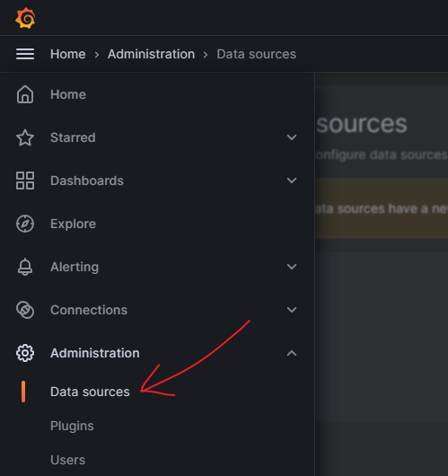
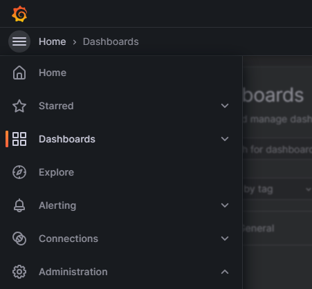
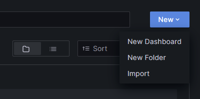
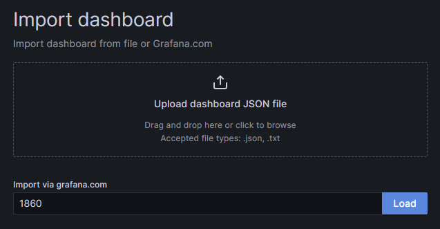
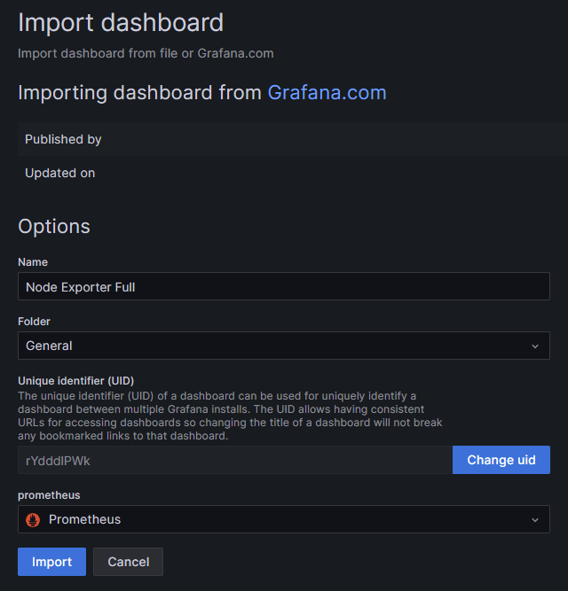
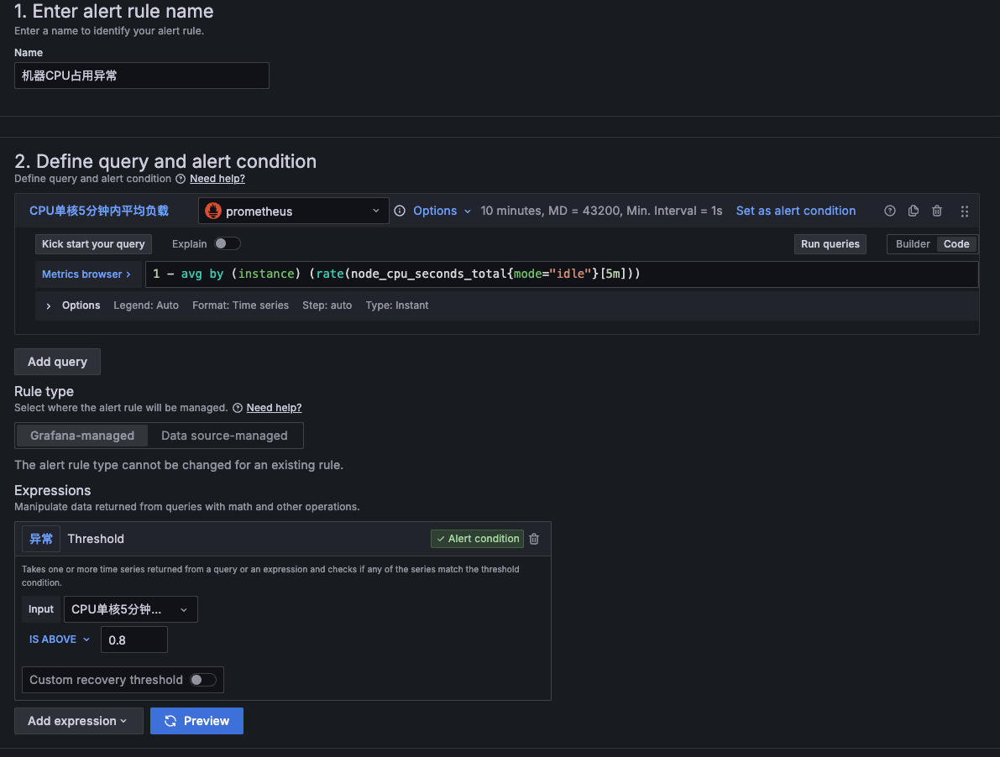
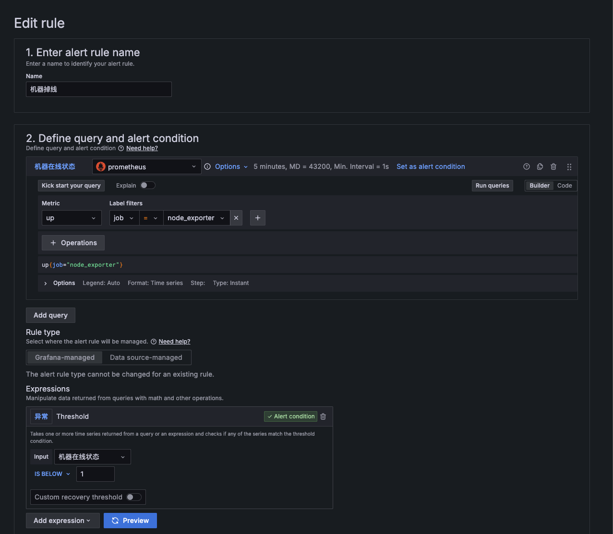
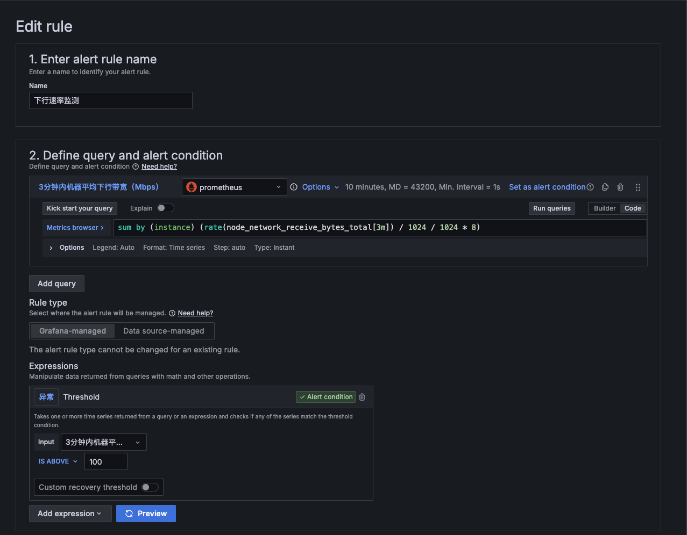
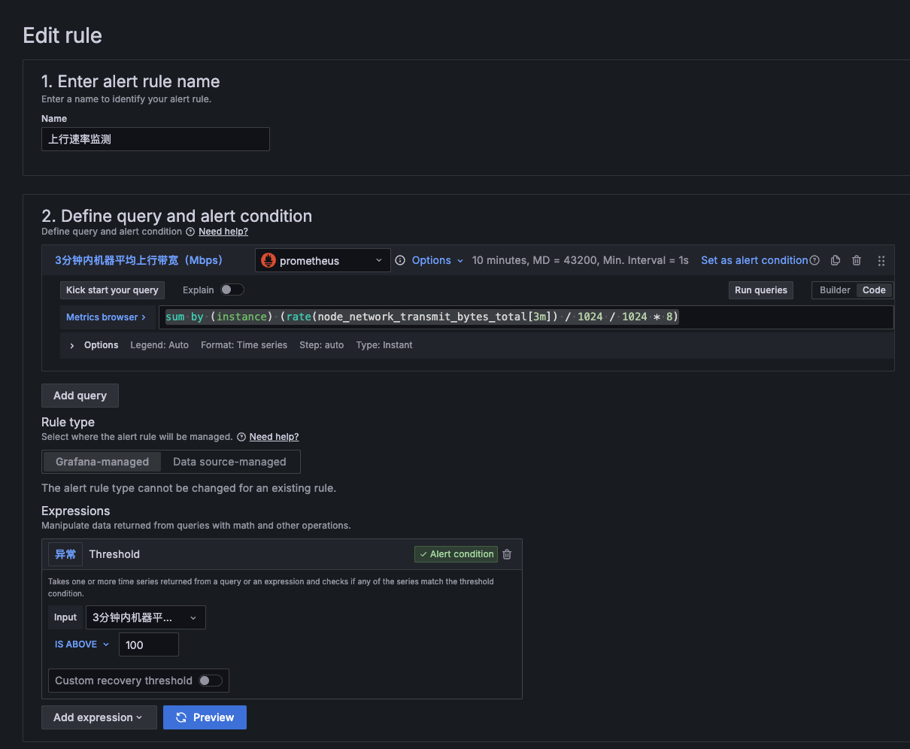
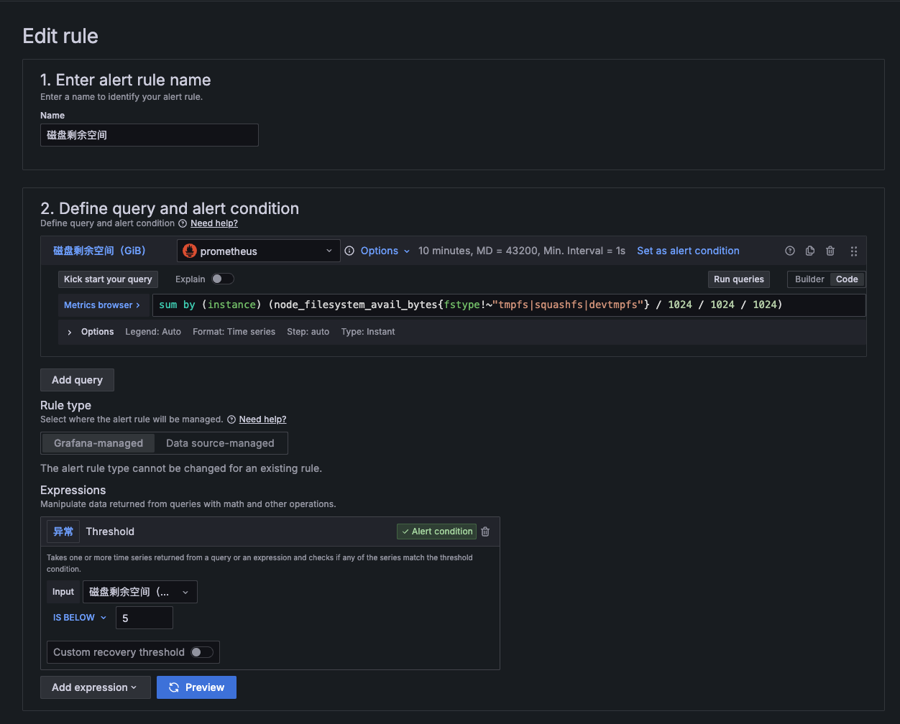

# 面板端
## 创建docker-compose.yml

```yaml
# <your project path>/docker-compose.yml
version: "3"  
services:  
  prometheus:  
    image: prom/prometheus:latest  
    container_name: prometheus  
    restart: unless-stopped  
    network_mode: "host"  
    volumes:  
      - ./prometheus/prometheus.yml:/etc/prometheus/prometheus.yml  
      - ./prometheus/prometheus:/prometheus  
      - ./prometheus/blackbox:/etc/prometheus/blackbox  
    command:  
      - "--config.file=/etc/prometheus/prometheus.yml"  
      - "--storage.tsdb.path=/prometheus"  
      - "--web.console.libraries=/etc/prometheus/console_libraries"  
      - "--web.console.templates=/etc/prometheus/consoles"  
      - "--web.enable-lifecycle"  
      - "--web.enable-admin-api"  
  grafana:  
    image: grafana/grafana:latest  
    container_name: grafana  
    network_mode: "host"  
    volumes:  
      - ./grafana/grafana:/var/lib/grafana  
      - ./grafana/provisioning/dashboards:/etc/grafana/provisioning/dashboards  
      - ./grafana/provisioning/datasources:/etc/grafana/provisioning/datasources  
      - ./grafana/conf/grafana.ini:/etc/grafana/grafana.ini
      - /path/to;:/etc/ssl/beocean.net 
    environment:  
      - GF_USERS_ALLOW_SIGN_UP=false  
    restart: unless-stopped
```

## 创建prometheus配置文件
```yaml
# <your project path>/prometheus/prometheus.yml
# Alertmanager configuration
alerting:
  alertmanagers:
    - static_configs:
        - targets:
          # - alertmanager:9093

# Load rules once and periodically evaluate them according to the global 'evaluation_interval'.
rule_files:
  # - "first_rules.yml"
  # - "second_rules.yml"

# A scrape configuration containing exactly one endpoint to scrape:
# Here it's Prometheus itself.
scrape_configs:
  # The job name is added as a label `job=<job_name>` to any timeseries scraped from this config.
  - job_name: "prometheus"

    # metrics_path defaults to '/metrics'
    # scheme defaults to 'http'.

    static_configs:
      - targets: ["localhost:<prometheus 端口>"]
  # node exporter
  - job_name: "node_exporter"
    scrape_interval: 30s
    static_configs:
      - targets: ["<监控节点IP>:<监控节点 node_exporter端口>"]
        labels:
          instance: '<监控节点名称>'
      # 可继续添加其他监控节点
      
  # blackbox exporter
  - job_name: "<监控节点名称>"
    metrics_path: '/probe'
    params:
      module: [tcp]
    file_sd_configs:
      - files:
        - '/etc/prometheus/blackbox/*.yml'
    relabel_configs:
        - source_labels: [__address__]
          target_label: __param_target
        - source_labels: [__param_target]
          target_label: instance
        - target_label: __address__
          replacement: <监控节点IP>:<监控节点 blackbox_exporter端口>"
        # 无ipv6可添加一下配置
        - source_labels: [ip]
          regex: 'IPv6'
          action: drop
  # 可继续添加其他监控节点
```

## 创建blackbox_exporter配置文件
```yaml
# <your project path>/prometheus/blackbox/ISP.yml
 # 北京
    - targets:
        - bj-cm-v4.ip.zstaticcdn.com:80 # 或 IPv4 IP
      labels:
        name: 'PEK | China Mobile'
        code: 'PEK'
        city: 'Beijing'
        isp: 'China Mobile'
        ip: 'IPv4'
        domestic: 'true'

    - targets:
        - bj-ct-v4.ip.zstaticcdn.com:80 # 或 IPv4 IP
      labels:
        name: 'PEK | China Telecom'
        code: 'PEK'
        city: 'Beijing'
        isp: 'China Telecom'
        ip: 'IPv4'
        domestic: 'true'

    - targets:
        - bj-cu-v4.ip.zstaticcdn.com:80 # 或 IPv4 IP
      labels:
        name: 'PEK | China Unicom'
        code: 'PEK'
        city: 'Beijing'
        isp: 'China Unicom'
        ip: 'IPv4'
        domestic: 'true'

 # 广州
    - targets:
        - gd-cm-v4.ip.zstaticcdn.com:80 # 或 IPv4 IP
      labels:
        name: 'CAN | China Mobile'
        code: 'CAN'
        city: 'Guangzhou'
        isp: 'China Mobile'
        ip: 'IPv4'
        domestic: 'true'

    - targets:
        - gd-ct-v4.ip.zstaticcdn.com:80 # 或 IPv4 IP
      labels:
        name: 'CAN | China Telecom'
        code: 'CAN'
        city: 'Guangzhou'
        isp: 'China Telecom'
        ip: 'IPv4'
        domestic: 'true'

    - targets:
        - gd-cu-v4.ip.zstaticcdn.com:80 # 或 IPv4 IP
      labels:
        name: 'CAN | China Unicom'
        code: 'CAN'
        city: 'Guangzhou'
        isp: 'China Unicom'
        ip: 'IPv4'
        domestic: 'true'

 # 上海
    - targets:
        - sh-cm-v4.ip.zstaticcdn.com:80 # 或 IPv4 IP
      labels:
        name: 'SHA | China Mobile'
        code: 'SHA'
        city: 'Shanghai'
        isp: 'China Mobile'
        ip: 'IPv4'
        domestic: 'true'

    - targets:
        - sh-ct-v4.ip.zstaticcdn.com:80 # 或 IPv4 IP
      labels:
        name: 'SHA | China Telecom'
        code: 'SHA'
        city: 'Shanghai'
        isp: 'China Telecom'
        ip: 'IPv4'
        domestic: 'true'

    - targets:
        - sh-cu-v4.ip.zstaticcdn.com:80 # 或 IPv4 IP
      labels:
        name: 'SHA | China Unicom'
        code: 'SHA'
        city: 'Shanghai'
        isp: 'China Unicom'
        ip: 'IPv4'
        domestic: 'true'


 # 长沙
    - targets:
        - hn-cm-v4.ip.zstaticcdn.com:80 # 或 IPv4 IP
      labels:
        name: 'CSX | China Mobile'
        code: 'CSX'
        city: 'Changsha'
        isp: 'China Mobile'
        ip: 'IPv4'
        domestic: 'true'

    - targets:
        - hn-ct-v4.ip.zstaticcdn.com:80 # 或 IPv4 IP
      labels:
        name: 'CSX | China Telecom'
        code: 'CSX'
        city: 'Changsha'
        isp: 'China Telecom'
        ip: 'IPv4'
        domestic: 'true'

    - targets:
        - hn-cu-v4.ip.zstaticcdn.com:80 # 或 IPv4 IP
      labels:
        name: 'CSX | China Unicom'
        code: 'CSX'
        city: 'Changsha'
        isp: 'China Unicom'
        ip: 'IPv4'
        domestic: 'true'


 # 新疆乌鲁木齐
    - targets:
        - xj-cm-v4.ip.zstaticcdn.com:80 # 或 IPv4 IP
      labels:
        name: 'URC | China Mobile'
        code: 'URC'
        city: 'Urumqi'
        isp: 'China Mobile'
        ip: 'IPv4'
        domestic: 'true'

    - targets:
        - xj-ct-v4.ip.zstaticcdn.com:80 # 或 IPv4 IP
      labels:
        name: 'URC | China Telecom'
        code: 'URC'
        city: 'Urumqi'
        isp: 'China Telecom'
        ip: 'IPv4'
        domestic: 'true'

    - targets:
        - xj-cu-v4.ip.zstaticcdn.com:80 # 或 IPv4 IP
      labels:
        name: 'URC | China Unicom'
        code: 'URC'
        city: 'Urumqi'
        isp: 'China Unicom'
        ip: 'IPv4'
        domestic: 'true'
```

## 修改grafana配置文件
- 目的：
    1. 通过https访问grafana
    2. 允许未登录用户访问

```ini
# <your project path>/grafana/conf/grafana.ini
#################################### Anonymous Auth ######################
[auth.anonymous]
# enable anonymous access
enabled = true

# specify organization name that should be used for unauthenticated users
org_name = Vistors

# specify role for unauthenticated users
org_role = Viewer

# mask the Grafana version number for unauthenticated users
;hide_version = false

# number of devices in total
device_limit = 10

#################################### Server ####################################
[server]
# Protocol (http, https, h2, socket)
protocol = https

# Minimum TLS version allowed. By default, this value is empty. Accepted values are: TLS1.2, TLS1.3. If nothing is set TLS1.2 would be taken
;min_tls_version = ""

# The ip address to bind to, empty will bind to all interfaces
;http_addr =

# The http port to use
;http_port = 3000

# The public facing domain name used to access grafana from a browser
;domain = localhost
domain = beocean.net
# Redirect to correct domain if host header does not match domain
# Prevents DNS rebinding attacks
;enforce_domain = false

# The full public facing url you use in browser, used for redirects and emails
# If you use reverse proxy and sub path specify full url (with sub path)
;root_url = %(protocol)s://%(domain)s:%(http_port)s/
root_url = https://<domain>:3000

# Serve Grafana from subpath specified in `root_url` setting. By default it is set to `false` for compatibility reasons.
;serve_from_sub_path = false

# Log web requests
;router_logging = false

# the path relative working path
;static_root_path = public

# enable gzip
;enable_gzip = false

# https certs & key file
cert_file = /etc/ssl/beocean.net/cert.pem
cert_key = /etc/ssl/beocean.net/key.pem

# optional password to be used to decrypt key file
;cert_pass =

# Certificates file watch interval
;certs_watch_interval =

# Unix socket gid
# Changing the gid of a file without privileges requires that the target group is in the group of the process and that the process is the file owner
# It is recommended to set the gid as http server user gid
# Not set when the value is -1
;socket_gid =

# Unix socket mode
;socket_mode =

# Unix socket path
;socket =

# CDN Url
;cdn_url =

# Sets the maximum time using a duration format (5s/5m/5ms) before timing out read of an incoming request and closing idle connections.
# `0` means there is no timeout for reading the request.
;read_timeout = 0

# This setting enables you to specify additional headers that the server adds to HTTP(S) responses.
[server.custom_response_headers]
#exampleHeader1 = exampleValue1
#exampleHeader2 = exampleValue2

[environment]
# Sets whether the local file system is available for Grafana to use. Default is true for backward compatibility.
;local_file_system_available = true
```

## 配置nginx反向代理
```
upstream grafana {
  server localhost:3000;
}

server {
    listen 443 ssl;
    listen [::]:443 ssl;
    ssl_certificate /path/to/certificate.crt;
    ssl_certificate_key /path/to/private.key;
    ssl_session_timeout 5m;
    ssl_protocols TLSv1 TLSv1.1 TLSv1.2 TLSv1.3;
    ssl_prefer_server_ciphers on;
    ssl_ciphers "TLS13-AES-256-GCM-SHA384:TLS13-CHACHA20-POLY1305-SHA256:TLS13-AES-128-GCM-SHA256:TLS13-AES-128-CCM-8-SHA256:TLS13-AES-128-CCM-SHA256:EECDH+CHACHA20:EECDH+CHACHA20-draft:EECDH+AES128:RSA+AES128:EECDH+AES256:RSA+AES256:EECDH+3DES:RSA+3DES:!MD5";
    ssl_session_cache builtin:1000 shared:SSL:10m;

    server_name <domain>;

    location / {
        proxy_http_version 1.1;
        proxy_set_header Upgrade $http_upgrade;
        proxy_set_header Connection "Upgrade";
        proxy_redirect off;
        proxy_set_header Host $http_host;
        #proxy_set_header True-Client-IP $http_true_client_ip;
        proxy_set_header X-Real-IP $http_true_client_ip;
        #proxy_set_header X-Forwarded-For $remote_addr;
        #proxy_set_header X-Forwarded-For $http_true_client_ip;
        #proxy_set_header X-Forwarded-For $proxy_add_x_forwarded_for;
        proxy_pass https://grafana;
      }
    
      # Proxy Grafana Live WebSocket connections.
      location /api/live/ {
        proxy_http_version 1.1;
        proxy_set_header Upgrade $http_upgrade;
        proxy_set_header Connection "Upgrade";
        #proxy_set_header Connection $connection_upgrade;
        proxy_set_header Host $host;
        proxy_pass https://grafana;
      }
}
```
- 检验nginx文件并重启nginx
```bash
nginx -t && service nginx restart
```

## 为prometheus数据源端口配置防火墙
```bash
sudo apt -y update && apt install -y ufw && sudo ufw allow from <面板IP> to any port <prometheus端口> && sudo ufw deny <prometheus端口> 
```

## 启动服务
```bash
docker-compose up -d
```

## 为Grafana添加prometheus数据源
1. 浏览器访问监控服务器的 3000 端口。例如，输入 http://ip_addr:3000 ，将 ip_addr 替换为实际 IP 地址。
2. Grafana 显示登录页面。使用用户名和默认密码 都是 admin 。当出现提示时，将密码更改为更安全的值。
3. 成功更改密码后，Grafana 将显示 Grafana 仪表板。
4. 要将 Prometheus 添加为数据源，请单击齿轮符号（代表配置），然后选择数据源。
   
5. 在下一个显示中，单击“添加数据源”按钮。
6. 选择Prometheus作为数据源。
7. 对于本地 Prometheus 源，将 URL 设置为`http://localhost:9090`。大多数其他设置可以保留默认值。
8. 点击保存

## Grafana设置面板模板
### Node Information面板
1. 选择菜单栏的`Dashboards`
   
2. 点击`Import`
   
3. 然后在 【Import via grafana.com】, 输入 ID `22403(英文) / 22869(中文)` 。然后选择【Load】。
   
4. 在下一个屏幕确认导入详细信息。选择 Prometheus 作为数据源，然后单击【Import】按钮。
   

### BBxPING Gen2 面板
1. 流程同上，模板 ID 改为 `22500`

## 配置监控规则
### 机器CPU占用异常
```bash
1 - avg by (instance) (rate(node_cpu_seconds_total{mode="idle"}[5m]))
```



### 机器掉线



### 下行速率监测
```bash
sum by (instance) (rate(node_network_receive_bytes_total[3m]) / 1024 / 1024 * 8)
```



### 上行速率监测
```bash
sum by (instance) (rate(node_network_transmit_bytes_total[3m]) / 1024 / 1024 * 8)
```



### 磁盘剩余空间
```bash
sum by (instance) (node_filesystem_avail_bytes{fstype!~"tmpfs|squashfs|devtmpfs"} / 1024 / 1024 / 1024)
```



# 监控节点端

## 安装node_exporter
```bash
wget -qO- 'https://raw.githubusercontent.com/AhFeil/bash-script/main/install-node_exporter.sh' | sudo bash
```

## 安装blackbox_exporter
```bash
bash <(curl -sSLf "https://raw.githubusercontent.com/midori01/common-scripts/main/blackbox-exporter/install.sh")
```

## 配置防火墙
```bash
sudo apt -y update && apt install -y ufw && sudo ufw default deny  && ufw allow 22 && sudo ufw allow from <面板IP> to any port <node_exporter端口> && sudo ufw allow from <面板IP> to any port <blackbox_exporter端口> && sudo ufw enable && sudo ufw reload
```

# 常见问题
## 为什么设置了防火墙allow规则不生效？
> 相同端口的allow规则必须在deny规则之前

# 参考文章
1. [🔹 Node Information - 更美观的 Grafana 性能监控面板 (Prometheus + Node Exporter) & Grafana 安装教程](https://www.nodeseek.com/post-209070-1)
2. [探针 Grafana + Prometheus 之比 Docker 更简单的部署流程](https://www.nodeseek.com/post-15265-1)
3. [◾️ BBxPing 面板 - 在 Grafana 上点亮地球 / Blackbox Exporter & Prometheus](https://www.nodeseek.com/post-218787-1)
4. [◾️ BBxPING Gen2 面板 - 在黑盒中拾星光 / 各版块介绍及使用指引](https://www.nodeseek.com/post-229346-1#0)